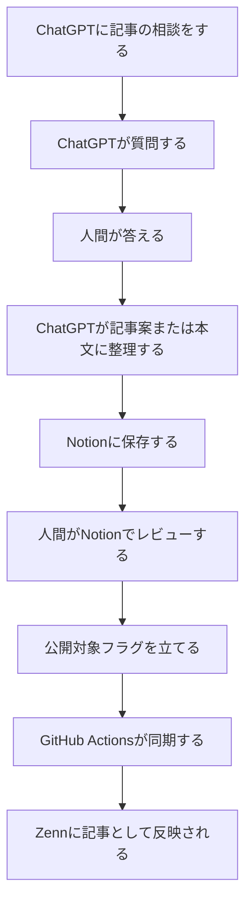
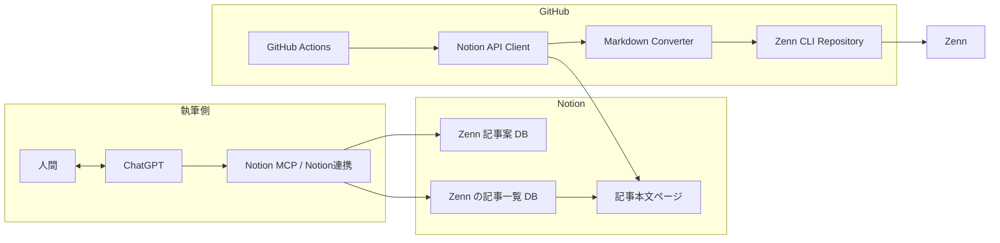
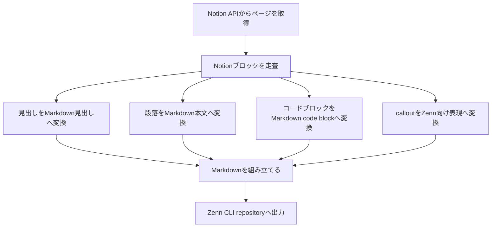

::::::::message
この記事は「ChatGPT・Notion・Zennで考えを記事にする仕組み」シリーズの第2回です。

第1回では、ChatGPTをライターではなくインタビュアーとして使う思想を書きました。
第2回では、その会話から記事を公開するまでの仕組みを説明します。
第3回では、ChatGPTプロジェクトのプロンプト設計と継続運用について書く予定です。
::::::::

# 導入

前回は、ChatGPTに記事を書かせるのではなく、ChatGPTをインタビュアーとして動かす、という話を書いた。
この記事では、その先の話を書く。インタビューによって考えを引き出せても、それがチャットの中に閉じているだけでは記事にはならない。記事案として保存し、本文として整理し、レビューし、公開する必要がある。
そこで、ChatGPT、Notion、GitHub、Zennをつなげて、考えを記事として外に出すまでの流れを作った。
この記事は、細かいコードの解説ではない。実装の詳細は環境によって変わるからだ。ここでは、どのコンポーネントに何を任せ、どこで人間が確認し、どこから先を自動化するかという設計を中心に書く。

# 利用者から見るとどう動くか

利用者側から見ると、やることはかなり単純である。
まず、ChatGPTに記事の相談をする。ChatGPTは、いきなり本文を書き始めるのではなく、インタビュアーとして質問する。私はそれに答える。必要な情報が集まったら、ChatGPTが記事案や本文の形に整理する。
記事案はNotionの「Zenn 記事案」databaseに保存する。実際に本文として書く段階になったら、Notionの「Zenn の記事一覧」databaseに記事ページを作る。
私はNotion上で内容を確認する。公開してよい記事は、更新対象のフラグを立てる。
その後はGitHub Actionsが定期的に動き、Notion APIから記事を取得し、Markdownに変換し、Zenn CLIのリポジトリへ反映する。
利用者視点では、流れは次のようになる。

この図で重要なのは、公開前に必ずNotionで人間がレビューする点である。ChatGPTに記事本文は作らせる。しかし、公開判断までは渡さない。

# システム構成

内部構成は、利用者視点より少し細かい。
ChatGPTはNotion連携を通じて、記事案databaseや記事本文databaseにアクセスする。GitHub ActionsはNotion APIを使い、記事本文databaseから更新対象の記事を取得する。
取得したNotionページは、そのままではZennの記事として使えない。そのため、Notionのブロック構造をMarkdownに変換する処理を挟む。
変換されたMarkdownは、Zenn CLIのリポジトリに配置される。そこから通常のZenn記事として扱えるようになる。
構成をコンポーネント単位で書くと、次のようになる。

この構成では、ChatGPTは執筆と整理を担当する。GitHub Actionsは同期と変換を担当する。Zennは公開先である。それぞれの責務を分けることで、仕組み全体が壊れにくくなる。

# NotionをCMSとして使う

この仕組みでは、NotionをCMSのように使っている。ただし、一般的なCMSのように公開画面を持たせているわけではない。Notionは、記事案と本文を管理する場所である。
記事案は「Zenn 記事案」databaseに置く。ここには、まだ本文として書き始める前のテーマ、問題意識、想定構成を入れる。
本文は「Zenn の記事一覧」databaseに置く。こちらは、公開または更新対象になりうる記事本文の置き場である。
この2つを分けた理由は、思いつきと公開候補を混ぜたくなかったからだ。記事案は未成熟でよい。断片的でもよい。ChatGPTと話しながら育てればよい。
一方で、記事本文databaseに入ったものは、Zennに出る可能性がある。したがって、タイトル、本文、記事種別、トピック、公開状態を明確に管理する必要がある。

# フラグで公開対象を制御する

記事本文databaseには、公開済みかどうかを表すプロパティと、次回更新対象かどうかを表すプロパティを持たせている。
この設計にすると、Notion上でレビューしたあとに、公開したい記事だけを更新対象にできる。GitHub Actions側は、すべての記事を処理する必要がない。更新対象のフラグが立っている記事だけを取得すればよい。
この仕組みは単純だが、かなり重要である。
ChatGPTが本文を書いたとしても、それだけでは公開されない。人間がNotion上で確認し、公開対象にしたものだけが後続の処理に乗る。ここで、AIの執筆能力と人間の公開判断を分離している。

# GitHub Actionsに同期処理を任せる

公開処理はGitHub Actionsに任せている。
理由は単純で、Zennの記事管理がGitHubリポジトリと相性がよいからだ。GitHub Actionsを使えば、定期実行もできるし、手動実行もできる。Notion APIを叩き、取得した内容をMarkdownに変換し、リポジトリに反映する処理も書きやすい。
この部分の実装は、主にClaudeに手伝ってもらった。
ChatGPTが記事を書き、Claudeがworkflowや実装の多くを作る。AIごとに得意な役割を分けた形になる。ここでも重要なのは、AIを一つの万能な存在として使っていないことだ。
記事の内容を整理するAI、workflowを書くAI、人間のレビュー、それぞれの役割を分けている。

# Notion APIからMarkdownへ変換する

Notion APIから取得できる記事本文は、Zennでそのまま使えるMarkdownではない。
Notionには、見出し、段落、箇条書き、コードブロック、calloutなどのブロックがある。これをZenn向けのMarkdownに変換する必要がある。
例えば、見出しはMarkdownの見出しに変換する。コードブロックは言語指定付きのcode blockに変換する。calloutはZenn側で扱いやすい形式に変換する。
この変換層を独立させておくと、Notion側の書き方を変えたときにも対応しやすい。
構成としては、次のような責務になる。

変換処理は、最初から完璧に作る必要はない。自分がNotion上で使うブロックを限定すれば、変換対象も限定できる。まずは見出し、段落、箇条書き、コードブロック、calloutだけ対応すれば、多くの記事は書ける。

# ChatGPTにGitHub権限を渡さない

この設計では、ChatGPTにGitHubの権限を渡していない。
ChatGPTは記事案を作り、記事本文を作り、Notionに整理する。そこまででよい。GitHubへのpushやZennへの反映は、GitHub Actionsが行う。
この分離には実務上の意味がある。
ChatGPTは文章作成には強い。一方で、公開につながる操作は、状態管理や権限管理が絡む。そこをChatGPTの会話だけで直接行う必要はない。
Notionに一度置き、人間が確認し、フラグを立て、それをworkflowが処理する。この間にレビューの余地がある。

# 実装を真似するときの最小構成

同じような仕組みを作る場合、最初から全部を作る必要はない。
最小構成は次のようになる。

1. Notionに記事本文用databaseを作る。
1. 記事タイトル、本文、公開対象フラグを管理する。
1. GitHub ActionsからNotion APIを叩く。
1. 更新対象の記事だけを取得する。
1. Notion本文をMarkdownに変換する。
1. Zenn CLIのリポジトリにMarkdownを書き出す。
1. GitHub上で差分を確認できるようにする。

この段階では、ChatGPT連携は必須ではない。
まずNotionからZennへ流せる道を作る。その後で、ChatGPTを記事案出しや本文作成に組み込むとよい。いきなりAI執筆から公開までを一気通貫で作ろうとすると、どこで問題が起きたのか分かりにくくなる。
NotionからMarkdownへ、MarkdownからZennへ、ChatGPTからNotionへ、というように分けて作る方がよい。

# この構成のよいところ

この構成のよいところは、記事を書くことと公開することを分けられる点である。
ChatGPTとの会話では、考えを出すことに集中できる。Notionでは、記事案と本文を管理し、レビューできる。GitHub Actionsでは、同期と変換を自動化できる。Zennでは、公開された記事として読者に届けられる。
それぞれの場所が、得意な役割を担当している。その結果、記事を書くことが「全部を一気にやる作業」ではなくなる。
話す。整理する。確認する。公開する。
この段階分けができるだけで、記事を出す心理的な負荷はかなり下がる。

# まとめ

第1回では、ChatGPTをライターではなくインタビュアーとして使う、という思想を書いた。
第2回では、その会話をNotionに保存し、GitHub ActionsでMarkdownに変換し、Zennへ反映する構成を書いた。
この仕組みの中心にあるのは、AIにすべてを任せることではない。ChatGPTには質問と整理を任せる。Notionには執筆とレビューの場所を任せる。GitHub Actionsには同期と変換を任せる。Zennには公開を任せる。
人間は、考えを話し、公開前に確認する。
この責務分離によって、考えを記事として外に出すまでの摩擦が小さくなる。
次回は、この仕組みを継続的に運用するために、ChatGPTプロジェクトにどのようなプロンプトを与えたかを書く。