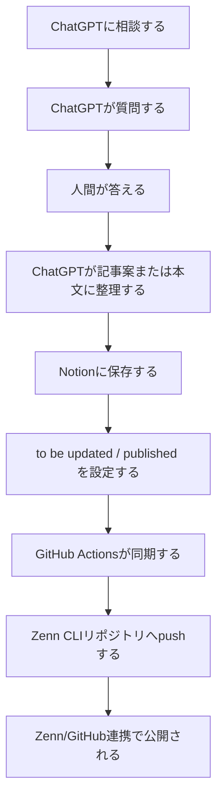
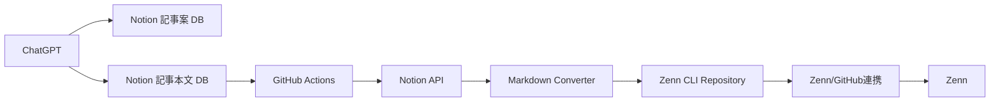
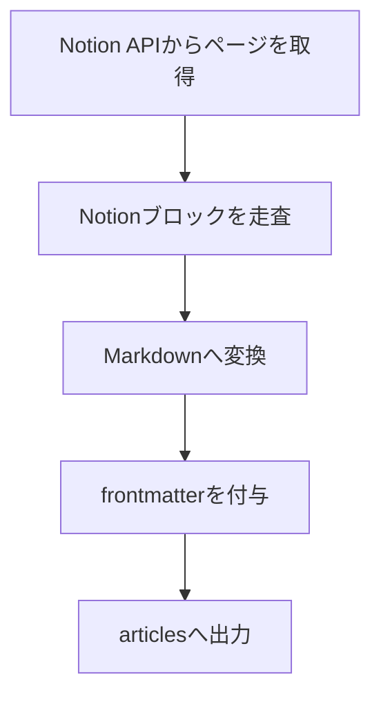

::::::::message
この記事は「ChatGPT・Notion・Zennで考えを記事にする仕組み」シリーズの第2回です。

第1回では、ChatGPTをライターではなくインタビュアーとして使う思想を書きました。
第2回では、その会話から記事公開までの仕組みを説明します。
この記事は ChatGPT をインタビュアーとして執筆しています。この記事のすべての文章が、ChatGPT によって生成されたものです。
::::::::

# 導入

前回は、ChatGPT に記事を書かせるのではなく、インタビュアーとして動かす話を書いた。
今回は、その先の話である。
インタビューで考えを引き出しても、それがチャットの中に閉じているだけでは記事にはならない。記事案として保存し、本文として整理し、レビューし、公開できる形にする必要がある。
そこで、ChatGPT、Notion、GitHub、Zenn をつなぐことにした。
Notion で記事を管理し、GitHub Actions で Zenn CLI リポジトリへ同期する。その後は Zenn/GitHub 連携で公開される。Notion の `published` を true にすれば、最終的に Zenn への公開まで進む。
この記事では、細かいコードではなく、全体の設計を書く。

# 利用者から見た流れ

利用者側から見ると、やることは単純である。
ChatGPT に記事の相談をする。ChatGPT は質問する。人間は答える。必要な情報が集まったら、ChatGPT が記事案や本文に整理する。
記事案は Notion の「Zenn 記事案」database に保存する。本文を書く段階になったら、「Zenn の記事一覧」database に記事ページを作る。
リポジトリへ同期したい記事は `to be updated` をオンにする。公開したい記事は `published` を true にする。
あとは GitHub Actions が定期的に動き、Notion API から記事を取得し、Markdown に変換し、Zenn CLI リポジトリへ push する。push 後は Zenn/GitHub 連携によって Zenn 側へ反映される。

公開判断は Notion のプロパティに集約される。
人間がレビューしてから `published` を true にしてもよいし、信頼できる範囲では ChatGPT にそこまで任せてもよい。

# システム構成

構成は大きく4つに分かれる。
1つ目は ChatGPT。記事案出し、インタビュー、本文化を担当する。
2つ目は Notion。記事案と記事本文を管理する。
3つ目は GitHub Actions。Notion から記事を取得し、Markdown に変換し、リポジトリへ push する。
4つ目は Zenn。GitHub 連携を通じて記事を公開する。

ChatGPT は執筆と整理を担当する。GitHub Actions は同期と変換を担当する。Zenn/GitHub 連携は公開反映を担当する。
責務を分けることで、どこで何が起きているかが分かりやすくなる。

# Notion を CMS として使う

Notion は、記事を管理する場所として使っている。
記事案は「Zenn 記事案」database に置く。まだ本文にする前のテーマ、問題意識、構成案を入れる場所である。
本文は「Zenn の記事一覧」database に置く。こちらは、Zenn に出る可能性がある記事の置き場である。
この2つを分けると、思いつきと公開候補が混ざらない。
記事案は未成熟でよい。断片的でもよい。ChatGPT と話しながら育てればよい。
一方で、記事本文 database に入ったものは、タイトル、type、topics、`to be updated`、`published` を明確に管理する。

# 公開状態をプロパティで制御する

この仕組みでは、主に2つのプロパティで状態を制御する。
`to be updated` は、次回 GitHub Actions でリポジトリへ同期するかどうかを表す。
`published` は、Zenn 側で公開するかどうかを表す。Markdown の frontmatter では `published: true` または `published: false` に対応する。
つまり、Notion 上で `published` を true にすれば、同期後に Zenn/GitHub 連携を通じて公開まで進む。
この設計にすると、執筆、同期、公開判断を分けられる。
ChatGPT は本文を書く。Notion は状態を持つ。GitHub Actions は同期する。Zenn/GitHub 連携は公開を反映する。

# GitHub Actions の役割

GitHub Actions は、Notion と Zenn CLI リポジトリをつなぐ部分である。
現在は毎日 8:00 JST に定期実行している。必要なら `workflow_dispatch` で手動実行もできる。
処理の流れは単純である。

1. repository を checkout する。
1. `npm i` を実行する。
1. `npm run sync` を実行する。
1. Notion API から記事を取得する。
1. Markdown を生成する。
1. `articles` に書き出す。
1. 差分を commit して push する。

この後は Zenn/GitHub 連携が Zenn 側への反映を担当する。

# Markdown 変換

Notion API から取得できる本文は、そのまま Zenn の Markdown ではない。
Notion の見出し、段落、箇条書き、コードブロック、callout などを、Zenn 向けの Markdown に変換する必要がある。

最初からすべての Notion block に対応する必要はない。
自分が記事で使う表現を限定すれば、変換対象も限定できる。見出し、段落、箇条書き、コードブロック、callout に対応すれば、かなりの記事は書ける。

# Claude に任せた部分

workflow と同期処理の実装は、主に Claude に手伝ってもらった。
Claude は、Zenn CLI を動かすリポジトリ側の workflow と、Notion から記事を取得して Markdown を生成する TypeScript を書いた。
`npm run sync` を実行すると、リポジトリの `articles` に Markdown が作られる。GitHub Actions はそれを定期実行し、差分を commit して push する。
ChatGPT が記事を書き、Claude が同期処理を書く。
AI ごとに得意な役割を分けた形である。

# 最小構成で真似するなら

同じような仕組みを作るなら、最初から全部を作る必要はない。
まずは Notion から Zenn CLI リポジトリへ Markdown を出せるようにする。
最小構成は次の通りである。

1. Notion に記事本文用 database を作る。
1. `to be updated` と `published` を持たせる。
1. GitHub Actions から Notion API を叩く。
1. 対象記事を Markdown に変換する。
1. Zenn CLI リポジトリの `articles` に書き出す。
1. commit して push する。

ChatGPT 連携は、その後でよい。
Notion から Markdown へ、Markdown から Zenn へ、ChatGPT から Notion へ。分けて作る方が、問題の切り分けもしやすい。

# まとめ

第1回では、ChatGPT をインタビュアーとして使う思想を書いた。
第2回では、その会話を記事として公開するための構成を書いた。
中心にあるのは、責務分離である。
ChatGPT には質問と整理を任せる。Notion には記事管理と公開状態を任せる。GitHub Actions には同期と変換を任せる。Zenn/GitHub 連携には公開反映を任せる。
人間は、考えを話し、必要に応じて確認し、公開状態を決める。
この構成にすると、記事を書くことは「最初から最後まで自分でやる作業」ではなくなる。
話す。整理する。同期する。公開する。
それぞれを別の場所に任せることで、考えを記事として外に出すまでの摩擦が小さくなる。